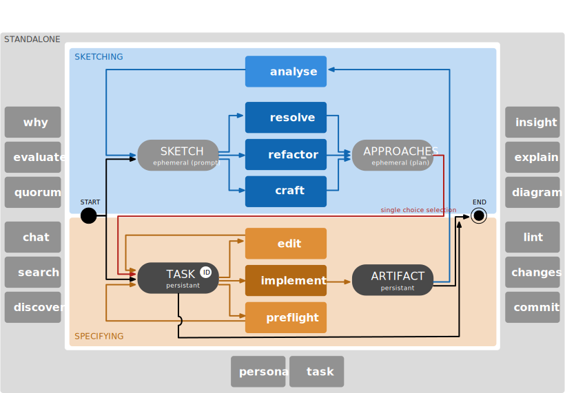

Agentic Software Engineering
============================

https://ase.tools

About
-----

**Agentic Software Engineering (ASE)** is the opinionated companion
tooling of *Dr. Ralf S. Engelschall* for combining the approach of
*Agentic AI* into *Software Engineering* with the help of *Agentic
AI Coding Tools* like *Claude Code*. **ASE** primarily consists of a
*Claude Code* plugin and a Command-Line Interface (CLI) tool, including
an *MCP* service. **ASE** provides skills and commands to support
the most important, recurring work-steps in the primary disciplines
of *Software Engineering*, especially in the discipline *Software
Development*.

> [!NOTE]
> **ASE** is *agentic*, but not pure *agent*-based, i.e., it focuses
> on supporting the role of a software engineer with *Agentic AI* and
> not driving the disciple software engineering with fully autonomous
> agents.

> [!NOTE]
> Initially, the primary focus of **ASE** is on the Agentic AI Coding
> tool *Claude Code*. Secondary focus is on the support for *GitHub
> Copilot CLI* (just set environment variable `ASE_TOOL=copilot`).
> Later, a forthcoming focus could be also on the alternative tools
> *OpenAI Codex*, *Google Gemini CLI*, or *OpenCode* &mdash; if their
> agent harness features (especially hooks, interactive user dialog
> tool, etc) support it.

> [!CAUTION]
> **ASE** is still under heavy development, still incomplete, partially
> broken and hence not ready for production use. If you are not a
> hard-boiled early adopter, please visit this project again, once we
> reached at least version 0.9.x!

Features
--------

**ASE** provides the following five distinct features:

- [**Configuration Scopes**](docs/configuration.md) (100% done):
  Parameters of project and agent can be configured on the hierarchy of
  the scopes *user*, *project*, *task*, and *skill*. This allows
  the flexible configuration of **ASE**.

- [**Session Constitution**](plugin/meta/ase-constitution.md) (95% done):
  All agent sessions have a "constitution" preloaded all the time, based
  on the configured parameters. This allows to control the *general*
  agent behavior.

- [**Task Skills**](plugin/skills/) (85% done):
  Recurring tasks are supported with dedicated skills, based on the
  configured parameters. This allows to control the *specific* agent
  behavior. Skills are grouped into meta (`ase-meta-*`), code
  (`ase-code-*`), architecture (`ase-arch-*`), and task (`ase-task-*`)
  families, covering 26 skills in total.

- **Context Gathering** (0% done):
  The agent context is loaded with individual information for all
  particular tasks. This allows the agent to more precisely perform the
  tasks.

- **Project Templates** (0% done):
  The agent is equipped with reasonable templates to scaffold
  Library/Framework, CLI and WebUI projects.

User Setup
----------

### Prerequisites

- [Claude Code](https://code.claude.com) or [GitHub Copilot CLI](https://github.com/features/copilot/cli)
- [Node.js](https://nodejs.org)

### Installation

```
#   install ASE tool into PATH (bootstrapping only)
npm install -g @rse/ase

#   install ASE plugin into agent tool
ase setup install [--tool claude|copilot]
```

### Updating

```
#   update ASE tool in PATH and ASE plugin in agent tool
ase setup update [--tool claude|copilot]
```

### Uninstallation

```
#   uninstall ASE tool from PATH and ASE plugin from agent tool
ase setup uninstall [--tool claude|copilot]
```

Overview
--------

### Agentic Levels &amp; ASE Sweetspot

We can distinguish multiple levels of Agentic AI Coding. **ASE**
focuses on the levels 1-3, i.e., it supports the assisted, agentic, and
delegated modes of operations best. **ASE** is especially not intended
for the full autonomous agent mode of operation.

[](docs/agentic-levels.pdf)

### Skills &amp; Workflow

The **ASE** skills can be classified into standalone/meta skills,
task-driven skills, and funnel skills.

[](docs/workflow.pdf)

When working with **ASE** the user decided (usually on the extend
of the task to perform) which mode to choose:

1. **Ad-Hoc Mode** (**Claude Code**):
   The default mode of the agent harness where the user just ad-hoc
   enters a prompt with an instruction. The instructions are persisted only
   in the current session.
2. **Plan Mode** (**Claude Code**):
   The advanced mode of the agent harness where the user enters a
   dedicated "plan mode" to initially craft and then continuously refine
   a plan. The plan has an ad-hoc format and is persisted internally
   by the agent, but is available in the current session only.
3. **Task Mode** (**ASE**):
   The more advanced mode of **ASE** where the user initially crafts and
   then continuously refines a task plan. The task plan has a fixed
   format and is persisted by **ASE** and hence is available across
   agent sessions.
4. **Funnel Mode** (**ASE**):
   The ultra advanced mode of **ASE** where the user first sketches the
   plan, then the agent figures out possible approaches, then the user
   selects one approach, then a task plan is created for this approach,
   and and then finally this switches over to the regular **Task Mode**.
   The task plan has a fixed format and is persisted by **ASE** and
   hence is available across agent sessions.

### Architecture &amp; Building Blocks

**ASE** primarily consists of a constitution, various skills, and
corresponding (CLI or MCP driven) tools.

[](docs/building-blocks.pdf)

Documentation
-------------

- [Setup: Installation, Update, Uninstallation](docs/setup.md)
- [Configuration: Parameters](docs/configuration.md)
- [Architecture: Building Blocks](docs/building-blocks.md)
- [Usage: Plugin Skills](docs/usage-plugin.md)
- [Usage: Plugin Tool](docs/usage-tool.md)
- [Workflow](docs/workflow.md)

See Also
--------

- [claudeX](https://github.com/rse/claudex) (convenience wrapper for Claude Code)

Support
-------

**ASE** is developed in the experience context of industrial Software
Engineering at the [*msg group*](https://www.msg.group) and in the
educational context of the *Software Engineering Academy (SEA)*. **ASE**
development is supported by *msg Research* and *Software Engineering
Academy (SEA)*.

Copyright & License
-------------------

Copyright &copy; 2025-2026 [Dr. Ralf S. Engelschall](https://engelschall.com)<br/>
Licensed under [GPL 3.0](https://spdx.org/licenses/GPL-3.0-only)

