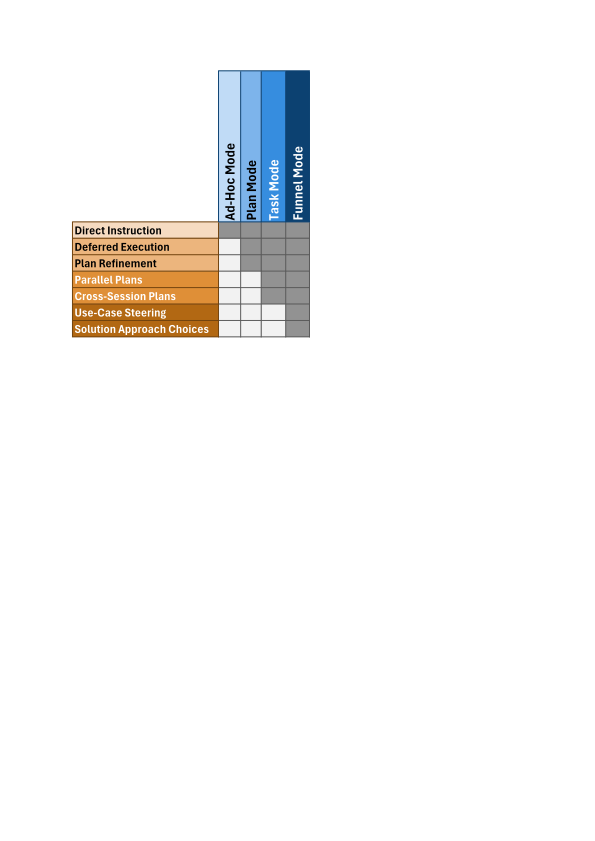

Agentic Software Engineering
============================

https://ase.tools

About
-----

**Agentic Software Engineering (ASE)** is the opinionated companion
tooling of *Dr. Ralf S. Engelschall* for combining the approach of
*Agentic AI* into *Software Engineering* with the help of *Agentic
AI Coding Tools* like *Claude Code*. **ASE** primarily consists of a
*Claude Code* plugin and a Command-Line Interface (CLI) tool, including
an *MCP* service. **ASE** provides skills and commands to support
the most important, recurring work-steps in the primary disciplines
of *Software Engineering*, especially in the discipline *Software
Development*.

> [!NOTE]
> The discipline of [*Agentic Software Engineering*](docs/agentic-software-engineering.md)
> in *general* is *Software Engineering*, supported by automomous *AI
> Agents* to perform tasks across the software development lifecycle.
> This **ASE** product in *particular* is also *agentic*, but not
> strictly based on autonomous agents. Instead, **ASE** focuses on
> supporting the role of a Software Engineer with *Agentic AI Coding
> Tools* towards multi-step operations and a plan/task-driven approach,
> but still strongly focuses on Human-in-the-Loop.

> [!NOTE]
> The primary focus of **ASE** is on the Agentic AI Coding tool *Claude
> Code*. The secondary focus is on the support for *GitHub Copilot CLI*
> (just set environment variable `ASE_TOOL=copilot`). In the future,
> a additional support could be provided also for alternative tools
> &mdash; if their agent harness features (especially hooks, interactive
> user dialog tool, etc) realistically allow it.

> [!CAUTION]
> **ASE** is still under active development, still somewhat incomplete,
> perhaps partially broken and hence not ready for production use. If
> you are not a hard-boiled early adopter, please visit this project
> again once we reached at least version 0.9.x!

Unique Selling Points
---------------------

Check out the following questions and corresponding **ASE** examples to
see whether **ASE** is right for you:

<table>
<tr>
<td width="50%" valign="top">

- **Boosted Sessions**: 
  You want to speed up your interactive sessions and at the same time
  reduce costs by reducing the amount of produced LLM output tokens?
  &rarr; `/ase-meta-persona engineer` or even `/ase-meta-persona caveman`

- **Alternative Approach Funnel**:
  You prefer a plan-driven approach, but the agent harness'
  Plan Mode is too unstructured and too direct, because you want to
  leverage from a funnel of alternative approaches first?
  &rarr; `/ase-code-craft hello: "ase hello" CLI command which prints a nice "Hello World" in red`

- **Named and Persisted Plans**:
  You prefer a plan-driven approach, but the agent harness'
  Plan Mode is regularly too weak, because you want named, persisted,
  and more strictly structured plans?
  &rarr; `/ase-task-edit hello`

- **Implementations Preflights**:
  You prefer a plan-driven approach, but want to pre-flight the
  implementation without later having to rewind artifacts via the version
  control system or the agent harness' session history?
  &rarr; `/ase-task-preflight hello`

- **Project Insights**:
  You want to get a quick insight into a project by determining the
  the author, the source files with the most churn, and the module
  structure?
  &rarr; `/ase-code-insight @tool`

- **Code Comprehension**:
  You want to better comprehend code by finding focused information on
  What, Why, Analogy, Diagram, Cruxes, and Gotchas?
  &rarr; `/ase-code-explain @tool/src/*.ts`

- **Logical Code Analysis**:
  You want to analyze code for potential problems
  related to a standard set of code quality aspects?
  &rarr; `/ase-code-lint @tool/src/*.ts`

</td>
<td width="50%" valign="top">

- **Lexical Code Analysis**:
  You want to analyze code for potential problems
  in its logic, semantics, and control flow?
  &rarr; `/ase-code-analyze @tool/src/*.ts`

- **Automated Change Logs**:
  You want to get your `CHANGELOG.md` entries
  automatically derived from your recent Git commits?
  &rarr; `/ase-meta-changes`

- **Root-Cause Analysis**:
  You want to understand the reason for a fact with the help of the
  "Five-Whys" root cause determination method?
  &rarr; `/ase-meta-why is the Decibel (dB) unit a logarithmic one?`

- **Research Quorum**:
  You want to research a fact by asking multiple (potentially available)
  foreign LLMs and methodologically derive a quorum answer?
  &rarr; `/ase-meta-quorum What is Agentic Software Engineering?`

- **Search Engine Consolidation**:
  You want to query multiple (potentially available) search engines
  and derive a consolidated result?
  &rarr; `/ase-meta-search What is Agentic Software Engineering?`

- **Foreign LLM Query**:
  You want to directly query a (potentially available) foreign LLM?
  &rarr; `/ase-meta-chat gemini What is Agentic Software Engineering?`

- **Package Discovery**:
  You want to be supported in the discovery of suitable packages
  for establishment of your technology stack?
  &rarr; `/ase-arch-discover reactive UI DOM rendering`

- **Multi-Criteria Decision Matrices**:
  You want to be supported in the evaluation of alternatives with the
  methodological help of a weighted multi-criteria decision matrix?
  &rarr; `/ase-meta-evaluate Vue vs. React vs. Angular, focus on TypeScript support and extensibility`

</td>
</tr>
</table>

User Setup
----------

### Prerequisites

- Operating System: macOS, Linux, Windows
- Agent Tool: [Claude Code](https://code.claude.com) or [GitHub Copilot CLI](https://github.com/features/copilot/cli)
- Runtime Engine: [Node.js](https://nodejs.org)

### Installation

```
#   install ASE tool into PATH (bootstrapping only)
npm install -g @rse/ase

#   install ASE plugin into agent tool
ase setup install [--tool claude|copilot]
```

### Updating

```
#   update ASE tool in PATH and ASE plugin in agent tool
ase setup update [--tool claude|copilot]
```

### Uninstallation

```
#   uninstall ASE tool from PATH and ASE plugin from agent tool
ase setup uninstall [--tool claude|copilot]
```

Features
--------

**ASE** provides the following six distinct features:

<table>
<tr>
<td width="50%" valign="top">

- [**Configuration Scopes**](docs/configuration.md) (100% done):
  Parameters of project and agent can be configured on the hierarchy of
  the scopes *user*, *project*, *task*, and *skill*. This allows
  the flexible configuration of **ASE**.

- [**Session Constitution**](plugin/meta/ase-constitution.md) (95% done):
  All agent sessions have a "constitution" preloaded all the time, based
  on the configured parameters. This allows to control the *general*
  agent behavior.

- [**Task Skills**](plugin/skills/) (85% done):
  Recurring tasks are supported with dedicated skills, based on the
  configured parameters. This allows to control the *specific* agent
  behavior. Skills are grouped into meta (`ase-meta-*`), code
  (`ase-code-*`), architecture (`ase-arch-*`), and task (`ase-task-*`)
  families, covering 26 skills in total.

</td>
<td width="50%" valign="top">

- **Artifact Formats** (0% done):
  The format of the four primary deliveries of Software Engineering
  (requirements specification, architecture description, documentation,
  and source code) and their artifacts are strictly defined to allow
  *both* humans *and* agents to operate on them concurrently.

- **Context Gathering** (0% done):
  The agent context is loaded with individual information for all
  particular tasks. This allows the agent to more precisely perform the
  tasks.

- **Project Templates** (0% done):
  The agent is equipped with reasonable templates to scaffold
  Library/Framework, CLI and WebUI projects.

</td>
</tr>
</table>

Design Decisions
----------------

**ASE** is based on the following four distinct design decisions:

<table>
<tr>
<td width="50%" valign="top">

- **Agent &amp; Plugin**:
  **ASE** is a plugin for the agent tools Claude Code and GitHub Copilot
  CLI, and can be non-intrusively installed, and later also residue-free
  uninstalled, from those agent tool at any time. Especially, **ASE** is
  intended to be used side-by-side with other skills and MCP services.

- **Recurring Software Engineering Tasks**:
  **ASE** targets the most important, recurring tasks in industrial
  Software Engineering only. Especially, **ASE** is not targeting
  Consulting or Operations business.

</td>
<td width="50%" valign="top">

- **Human in the Loop**:
  **ASE** targets the scenario of a person performing Software
  Engineering tasks. Especially, **ASE** is not intended for full
  autonomous agent scenarios, even if its skills can be conveniently
  chained.

- **Skills & MCP/CLI**:
  **ASE** skills are strongly coupled to and work on top of the
  corresponding **ASE** MCP/CLI service. Especially, the **ASE** skills
  are not written to be used in foreign environments.

</td>
</tr>
</table>

Overview
--------

The following gives a short overview of the concepts and building blocks of **ASE**:

### Agentic Levels &amp; ASE Sweetspot

We can distinguish multiple levels of Agentic AI Coding. **ASE**
focuses on the levels 1-3, i.e., it supports the assisted, agentic, and
delegated modes of operations best. **ASE** is especially not intended
for the full autonomous agent mode of operation.

[](docs/agentic-levels.pdf)

### Skills &amp; Workflow

The **ASE** skills can be classified into standalone/meta skills,
task-driven skills, and funnel skills.

[](docs/workflow.pdf)

### Agent Harness &amp; Operation Modes

When working with **ASE** the user decides (usually on the estimated extend
and complexity of the task to perform) which operation mode to choose:

[](docs/operation-modes.pdf)

1. **Ad-Hoc Mode** (**Claude Code**):
   The default mode of the agent harness where the user just ad-hoc
   enters a prompt with an instruction. The instructions are persisted only
   in the current session.

2. **Plan Mode** (**Claude Code**):
   The advanced mode of the agent harness where the user enters a
   dedicated "plan mode" to initially craft and then continuously refine
   a plan. The plan has an ad-hoc format and is persisted internally
   by the agent, but is available in the current session only.

3. **Task Mode** (**ASE**):
   The more advanced mode of **ASE** where the user initially crafts and
   then continuously refines a task plan. The task plan has a fixed
   format and is persisted by **ASE** and hence is available across
   agent sessions.

4. **Funnel Mode** (**ASE**):
   The ultra advanced mode of **ASE** where the user first sketches the
   plan, then the agent figures out possible approaches, then the user
   selects one approach, then a task plan is created for this approach,
   and and then finally this switches over to the regular **Task Mode**.
   The task plan has a fixed format and is persisted by **ASE** and
   hence is available across agent sessions.

### Architecture &amp; Building Blocks

**ASE** primarily consists of a constitution, various skills, and
corresponding (CLI or MCP driven) tools.

[](docs/building-blocks.pdf)

Documentation
-------------

- [Setup: Installation, Update, Uninstallation](docs/setup.md)
- [Configuration: Parameters](docs/configuration.md)
- [Architecture: Building Blocks](docs/building-blocks.md)
- [Usage: Plugin Skills](docs/usage-plugin.md)
- [Usage: Plugin Tool](docs/usage-tool.md)
- [Workflow](docs/workflow.md)

See Also
--------

- [claudeX](https://github.com/rse/claudex) (convenience wrapper for Claude Code)

Support
-------

**ASE** is developed in the experience context of industrial Software
Engineering at the [*msg group*](https://www.msg.group) and in the
educational context of the *Software Engineering Academy (SEA)*. **ASE**
development is supported by *msg Research* and *Software Engineering
Academy (SEA)*.

Copyright & License
-------------------

Copyright &copy; 2025-2026 [Dr. Ralf S. Engelschall](https://engelschall.com)<br/>
Licensed under [GPL 3.0](https://spdx.org/licenses/GPL-3.0-only)

